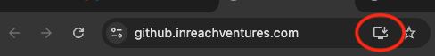

# GitHub CI Status

A minimal PWA that shows the last 5 GitHub Actions workflow runs for any set of repos, with auto-refresh. Can be installed as a standalone desktop app via Chrome.

## Quickest option — use the deployed app

Open **[github.inreachventures.com](https://github.inreachventures.com)** — no install, no server needed.

You'll be asked for a GitHub Personal Access Token on first run. [Create one here](https://github.com/settings/tokens/new?description=github_status%20dashboard&scopes=repo,workflow,read:org) with `repo`, `workflow`, and `read:org` scopes. Your token is stored only in your browser's local storage — nothing is sent to any server.

## Run it yourself (local Python server)

If you'd rather host it yourself:

```bash
git clone https://github.com/inreachventures/github_status
cd github_status
python3 -m http.server 8765
```

Then open `http://localhost:8765` in your browser.

## Features

- Any number of repos across any GitHub org — displayed in a max-3-column grid
- Auto-refresh every 10 seconds (configurable from 10s to 2m)
- Mood indicator based on overall build health
- Click any run to open it in GitHub
- Installable as a standalone macOS/Windows/Linux app via Chrome PWA

## Install as a desktop app (recommended)

Serve the app over HTTP (see above), open it in Chrome, then click the install icon (⊕) in the address bar → **Install**.



## Layout

Repos are displayed in a responsive grid with a maximum of 3 columns:

| Repos | Rows |
|-------|------|
| 1–3   | 1    |
| 4–6   | 2    |
| 7–9   | 3    |
| …     | …    |

## Reset settings

Open DevTools → Application → Local Storage → delete `gh_token`, `gh_org`, `gh_repos`.

## Files

```
github_status/
  index.html    — single-file app (inline CSS + JS, no build step, no dependencies)
  manifest.json — PWA metadata
  sw.js         — service worker (enables PWA install)
  icon.svg      — app icon
```
